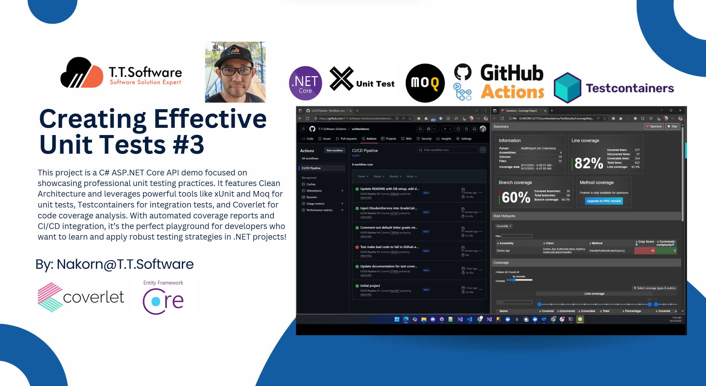
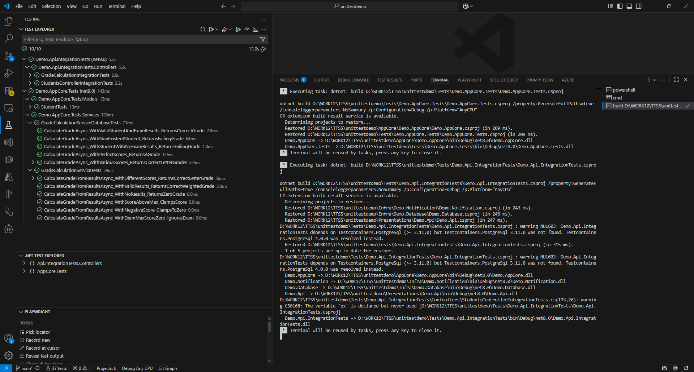
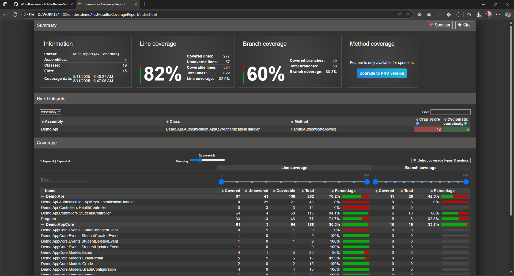
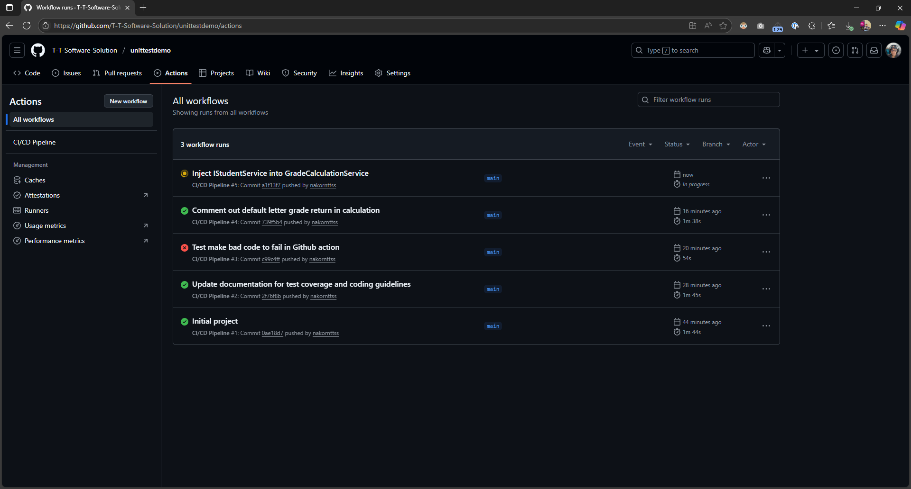
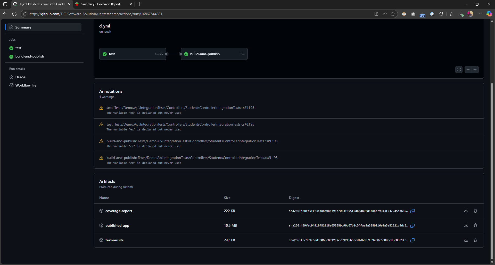

# Demo Unit Test Project



A comprehensive C# ASP.NET Core API project demonstrating unit testing best practices with Clean Architecture.

## Features

- **Clean Architecture** with separation of concerns
- **Grade calculation** using weighted averages
- **Student management** with CRUD operations
- **Notification system** with Email/SMS mocking
- **Comprehensive testing** with 80% coverage requirement
- **PostgreSQL database** with Entity Framework Core
- **API authentication** (optional API key)
- **Docker support** with Testcontainers for integration tests

## Project Structure

```
├── AppCore/Demo.AppCore/          # Application Core (Models, Interfaces, Services)
├── Infra/Demo.Database/           # Database Infrastructure (EF Core, Repositories)
├── Infra/Demo.Notification/       # Notification Services (Email, SMS mocks)
├── Presentations/Demo.Api/        # Web API Controllers
├── Tests/Demo.AppCore.Tests/      # Unit Tests (xUnit + Moq)
└── Tests/Demo.Api.IntegrationTests/ # Integration Tests (Testcontainers)
```

## Technologies Used

- **.NET 8.0**
- **ASP.NET Core Web API**
- **Entity Framework Core**
- **PostgreSQL**
- **xUnit** for testing
- **Moq** for mocking
- **Testcontainers** for integration testing
- **Coverlet** for code coverage
- **GitHub Actions** for CI/CD

## Getting Started

### Prerequisites

- .NET 8.0 SDK
- PostgreSQL (or Docker for development)
- Git

### Database Setup

The application uses PostgreSQL with the following default connection for development:
```
Server=localhost;Port=65432;Database=demounittest01;User ID=admin;Password=admin;Include Error Detail=true;
```

#### Using Real Database with User Secrets (Recommended)

For production or when using a real database, use .NET User Secrets to store sensitive connection strings:

**Step 1: Initialize User Secrets**
```bash
cd Presentations/Demo.Api
dotnet user-secrets init
```

**Step 2: Set Connection String**
```bash
# Replace with your actual database connection string
dotnet user-secrets set "ConnectionStrings:DefaultConnection" "Server=your-server;Port=5432;Database=your-db;User ID=your-user;Password=your-password;Include Error Detail=true;"
```

**Step 3: Verify Secrets**
```bash
dotnet user-secrets list
```

**Environment Variables (Alternative)**
You can also use environment variables:
```bash
# Windows
set ConnectionStrings__DefaultConnection="Server=your-server;Port=5432;Database=your-db;User ID=your-user;Password=your-password"

# Linux/macOS
export ConnectionStrings__DefaultConnection="Server=your-server;Port=5432;Database=your-db;User ID=your-user;Password=your-password"
```

**Production Configuration**
For production deployments, use:
- Azure Key Vault
- AWS Secrets Manager
- Kubernetes Secrets
- Environment variables in secure hosting platforms

> **⚠️ Security Note**: Never commit connection strings with credentials to source control. Always use user secrets, environment variables, or secure key management services.

### Running the Application

1. Clone the repository
2. Restore dependencies:
   ```bash
   dotnet restore Demo.sln
   ```
3. Build the solution:
   ```bash
   dotnet build Demo.sln
   ```
4. Run the API:
   ```bash
   dotnet run --project Presentations/Demo.Api/Demo.Api.csproj
   ```

### Running Tests

**Unit Tests:**
```bash
dotnet test Tests/Demo.AppCore.Tests/Demo.AppCore.Tests.csproj
```

**Integration Tests:**
```bash
dotnet test Tests/Demo.Api.IntegrationTests/Demo.Api.IntegrationTests.csproj
```

**All Tests:**
```bash
dotnet test Demo.sln
```

### Code Coverage Reports

This project uses **Coverlet** for code coverage collection and **ReportGenerator** for creating HTML reports.

#### Prerequisites

Install ReportGenerator as a global tool:
```bash
dotnet tool install -g dotnet-reportgenerator-globaltool
```

#### Generate Coverage Reports

**Step 1: Run Tests with Coverage Collection**
```bash
dotnet test Demo.sln --collect:"XPlat Code Coverage" --results-directory ./TestResults
```

**Step 2: Generate HTML Coverage Report**
```bash
reportgenerator -reports:"TestResults\**\coverage.cobertura.xml" -targetdir:"TestResults\CoverageReport" -reporttypes:"Html"
```

**Step 3: View the Report**
Open `TestResults\CoverageReport\index.html` in your web browser.

#### Alternative Report Formats

Generate multiple report formats:
```bash
# HTML + XML + Text Summary
reportgenerator -reports:"TestResults\**\coverage.cobertura.xml" -targetdir:"TestResults\CoverageReport" -reporttypes:"Html;Cobertura;TextSummary"

# Just text summary for quick viewing
reportgenerator -reports:"TestResults\**\coverage.cobertura.xml" -targetdir:"TestResults\CoverageReport" -reporttypes:"TextSummary"
```

#### Coverage Report Features

The generated HTML report includes:
- **📊 Overall Coverage Metrics**: Line coverage, branch coverage, assembly summary
- **🔍 Detailed Class Views**: Line-by-line coverage for each class
- **📱 Interactive Interface**: Sortable tables, search functionality, responsive design  
- **🎨 Visual Indicators**: Color-coded coverage (green = covered, red = not covered)
- **📈 Historical Tracking**: Coverage trends when run multiple times

#### Coverage Requirements

- **Minimum Coverage**: 80% line coverage required
- **Current Coverage**: 82% ✅ (exceeds requirement)
- **Enforcement**: GitHub Actions will fail builds below 80% coverage

#### One-Command Coverage Report

For convenience, you can combine both steps:
```bash
# Windows
dotnet test Demo.sln --collect:"XPlat Code Coverage" --results-directory ./TestResults && reportgenerator -reports:"TestResults\**\coverage.cobertura.xml" -targetdir:"TestResults\CoverageReport" -reporttypes:"Html" && start TestResults\CoverageReport\index.html

# Alternative (without auto-open)
dotnet test Demo.sln --collect:"XPlat Code Coverage" --results-directory ./TestResults && reportgenerator -reports:"TestResults\**\coverage.cobertura.xml" -targetdir:"TestResults\CoverageReport" -reporttypes:"Html"
```

## API Endpoints

- `GET /healthz` - Health check
- `GET /api/students` - Get all students
- `GET /api/students/{id}` - Get student by ID
- `GET /api/students/{id}/grade` - Get student's calculated grade
- `POST /api/students` - Create new student
- `PUT /api/students/{id}` - Update student
- `DELETE /api/students/{id}` - Delete student

## Grade Calculation

Grades are calculated using weighted averages:

- **Formula**: `total = Σ(score/maxScore * weight)`
- **Final Grade**: `(total / weightSum) * 100`
- **Letter Grades**: A (≥90%), B (80-89%), C (70-79%), D (60-69%), F (<60%)

## Testing Strategy

The project follows the **AAA pattern** (Arrange, Act, Assert):

- **Unit Tests**: Test individual components in isolation using mocks
- **Integration Tests**: Test complete workflows with real database via Testcontainers
- **Coverage Gate**: Minimum 80% code coverage required for builds

## CI/CD Pipeline

GitHub Actions workflow includes:

- Automated testing on push/PR
- Code coverage reporting
- Coverage threshold enforcement (80%)
- Automated builds and deployments

## Authentication

Optional API key authentication can be enabled in production:

- Set `ApiKeyRequired: true` in configuration
- Include `X-Api-Key` header with requests
- Default key: `demo-api-key-12345`

## Screenshots and Examples

### VS Code Test Runner


### Code Coverage Report


### GitHub Actions CI/CD Pipeline


### CI/CD Artifacts


## Additional Resources

This project demonstrates practical unit testing techniques and Clean Architecture patterns. For detailed insights on creating effective unit tests, check out these articles:

📚 **Related Articles (Thai):**
- [การสร้าง Unit Test ที่มีประสิทธิภาพ ลดภาระ เพิ่มคุณค่า เพื่อ Unit Test ที่ยั่งยืน](https://medium.com/t-t-software-solution/%E0%B8%81%E0%B8%B2%E0%B8%A3%E0%B8%AA%E0%B8%A3%E0%B9%89%E0%B8%B2%E0%B8%87-unit-test-%E0%B8%97%E0%B8%B5%E0%B9%88%E0%B8%A1%E0%B8%B5%E0%B8%9B%E0%B8%A3%E0%B8%B0%E0%B8%AA%E0%B8%B4%E0%B8%97%E0%B8%98%E0%B8%B4%E0%B8%A0%E0%B8%B2%E0%B8%9E-%E0%B8%A5%E0%B8%94%E0%B8%A0%E0%B8%B2%E0%B8%A3%E0%B8%B0-%E0%B9%80%E0%B8%9E%E0%B8%B4%E0%B9%88%E0%B8%A1%E0%B8%84%E0%B8%B8%E0%B8%93%E0%B8%84%E0%B9%88%E0%B8%B2-%E0%B9%80%E0%B8%9E%E0%B8%B7%E0%B9%88%E0%B8%AD-unit-test-%E0%B8%97%E0%B8%B5%E0%B9%88%E0%B8%A2%E0%B8%B1%E0%B9%88%E0%B8%87%E0%B8%A2%E0%B8%B7%E0%B8%99-5473d7e9b686) - Best practices for sustainable unit testing
- [การสร้าง Unit Test ที่มีประสิทธิภาพ 2 ต่อจาก Week ที่แล้ว](https://medium.com/t-t-software-solution/%E0%B8%81%E0%B8%B2%E0%B8%A3%E0%B8%AA%E0%B8%A3%E0%B9%89%E0%B8%B2%E0%B8%87-unit-test-%E0%B8%97%E0%B8%B5%E0%B9%88%E0%B8%A1%E0%B8%B5%E0%B8%9B%E0%B8%A3%E0%B8%B0%E0%B8%AA%E0%B8%B4%E0%B8%97%E0%B8%98%E0%B8%B4%E0%B8%A0%E0%B8%B2%E0%B8%9E-2-%E0%B8%95%E0%B9%88%E0%B8%AD%E0%B8%88%E0%B8%B2%E0%B8%81-week-%E0%B8%97%E0%B8%B5%E0%B9%88%E0%B9%81%E0%B8%A5%E0%B9%89%E0%B8%A7-a843f7357da0) - Advanced unit testing patterns and techniques

These articles provide deep insights into the principles and practices demonstrated in this codebase.

## Contributing

1. Fork the repository
2. Create a feature branch
3. Write tests for new functionality
4. Ensure all tests pass and coverage meets requirements
5. Submit a pull request